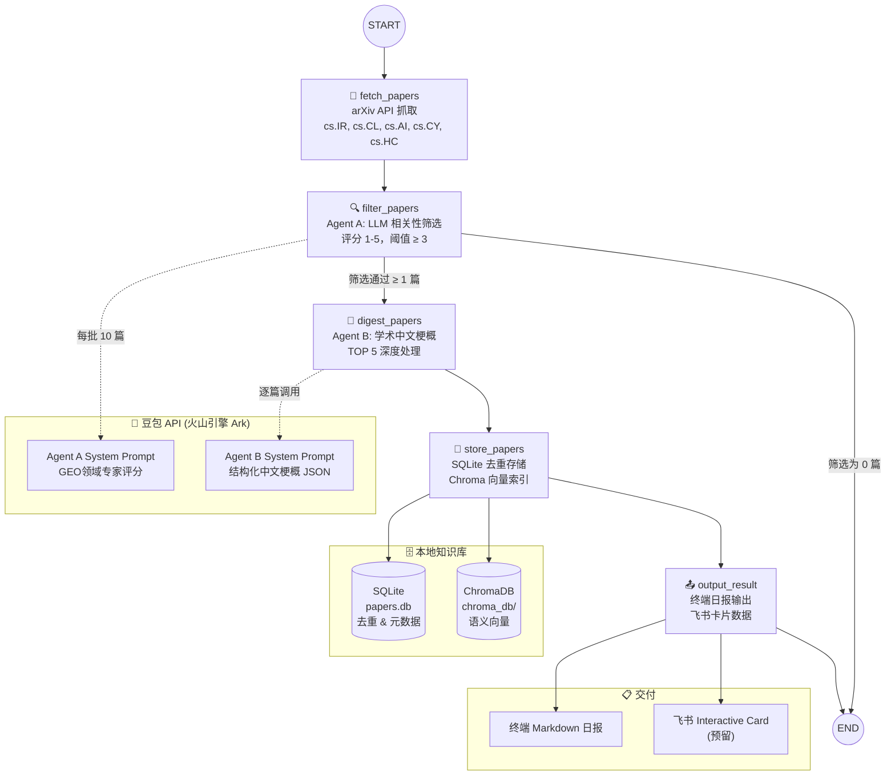

# GEO Agent 工作流图

```mermaid
flowchart TD
    START((START)) --> fetch["📡 fetch_papers<br/>arXiv API 抓取<br/>cs.IR, cs.CL, cs.AI, cs.CY, cs.HC"]
    
    fetch --> filter["🔍 filter_papers<br/>Agent A: LLM 相关性筛选<br/>评分 1-5，阈值 ≥ 3"]
    
    filter --> |"筛选通过 ≥ 1 篇"| digest["📝 digest_papers<br/>Agent B: 学术中文梗概<br/>TOP 5 深度处理"]
    
    filter --> |"筛选为 0 篇"| END((END))
    
    digest --> store["💾 store_papers<br/>SQLite 去重存储<br/>Chroma 向量索引"]
    
    store --> output["📤 output_result<br/>终端日报输出<br/>飞书卡片数据"]
    
    output --> END

    subgraph LLM["🤖 豆包 API (火山引擎 Ark)"]
        filter_llm["Agent A System Prompt<br/>GEO领域专家评分"]
        digest_llm["Agent B System Prompt<br/>结构化中文梗概 JSON"]
    end

    filter -.->|"每批 10 篇"| filter_llm
    digest -.->|"逐篇调用"| digest_llm

    subgraph Storage["🗄️ 本地知识库"]
        sqlite[("SQLite<br/>papers.db<br/>去重 & 元数据")]
        chroma[("ChromaDB<br/>chroma_db/<br/>语义向量")]
    end

    store --> sqlite
    store --> chroma

    subgraph Output["📋 交付"]
        terminal["终端 Markdown 日报"]
        feishu["飞书 Interactive Card<br/>(预留)"]
    end

    output --> terminal
    output --> feishu
```
